 

# SEU NOME

**Desenvolvedor &nbsp;·&nbsp; Empreendedor &nbsp;·&nbsp; Professor**

 

 

## `01 // sobre`

Há mais de 16 anos eu construo e evoluo sistemas que as empresas não podem se dar ao luxo de ver parados. Meu trabalho gira em torno de uma ideia: **automatizar operações empresariais**, para que as pessoas gastem seu tempo no que exige decisão, e não repetição.

Sou à vontade com tecnologia de ponta a ponta e estou em casa com **inteligência artificial**, do estudo à aplicação em problemas reais de negócio.

Gosto de construir, de liderar e de ensinar. Por isso minha rotina se divide em três frentes.

## `02 // frentes de atuação`

## `03 // formação`

## `04 // contato`

Quer conversar sobre automação, inteligência artificial ou parcerias?

[**LinkedIn**](https://www.linkedin.com/in/SEU-PERFIL) &nbsp;·&nbsp; [**Arrematch.ai**](https://arrematch.ai) &nbsp;·&nbsp; [**SGD**](https://sgd.claro.com.br)

 

